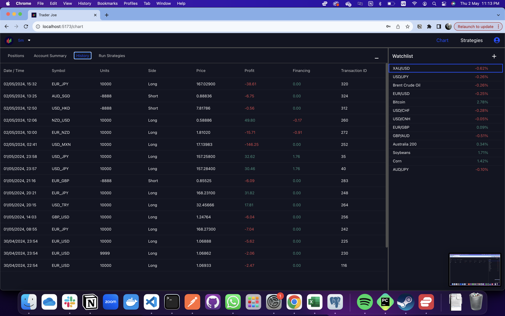

# GA SEI Project 4 - TraderJoe

## Introduction

TraderJoe is an algorithmic trading platform designed to seamlessly integrate with OANDA's trading services. This platform allows traders to automate their trading strategies, monitor performance, and manage trades in real-time. TraderJoe is tailored for both individual traders and trading managers, providing a comprehensive set of tools to upload, execute, and monitor algorithmic trading scripts.

## Key Features

### Strategy Management

Users can upload and manage their custom trading algorithms written in Python. The platform supports direct execution of these scripts, handling trade signals with precision and efficiency.

### Live Trading Dashboard

A dynamic and user-friendly interface that displays active trades, performance metrics, and real-time market data.

### Performance Analysis

TraderJoe offers detailed analytics on trading performance, including realized and unrealized profits and losses, with filters for various time frames such as daily, weekly, monthly, and yearly.

### Secure Trading

Integrated securely with OANDA's API, TraderJoe ensures that all trading activities are conducted within a safe and encrypted environment.

### User Roles and Management

Specialized access control allows managers to oversee the trading activities of multiple traders, providing tools to review and manage group performance comprehensively.

## Technology

**Front-end:**

- HTML
- CSS (Bootstrap with modular vanilla css)
- JavaScript
- React

**Back-end:**

- Flask
- PostgreSQL (psycopg3)

**Trading scripts:**

- Python

## Getting Started

Please create and populate the tables in PostgreSQL per SQL statements in "TraderJoe/backend/create_tables.sql". Kindly ensure that the first user registered via the frontend has "Trader" role.

### User Journey (Trader)

1. Upon log in, a trader will be directed to the "Home" page.


2. The trader can manage his strategies by navigating to Strategies page. In this page, the trader will be able to view, update, add and delete his strategies via intuitive buttons.


3. The trader can navigate to Chart page. This page is composed of multiple smaller interfaces with a large candlestick chart in the center that traders can review price action on various time scales. Time scales of various levels can be selected from the top left dropdown button in the navigation bar.


4. Alternatively, traders can view, add, select and delete instruments in their watchlist. Selecting an instrument in their watchlist will cause their chart to render with the instrument's price action. Adding instruments in their watchlist is done via a pop up modal. Instruments can be searched for via a dynamic search bar that filters instruments in real time.


5. Lastly traders can access a submenu below the chart by clicking on the links or clicking on the expand button.

6. The first submenu item is Positions which displays details of all strategies that are current in open trades.


7. The second submenu item is Account Summary which displays the trader's account details like NAV, balance, realized and unrealized P/L, etc.


8. The third submenu item is History which displays details of all trades that have closed.



9. The fourth submenu item is Run Strategies which displays a list of strategies and instrument pairings that the trader has in his portfolio. This page is the crux of the app where traders can initiate running new strategy, instrument & trade pairings and monitor the statuses of each pairing across its life cycle.


10. New strategy, instrument & trade pairings starts its life cycle as "Pending signal" status where the trading script starts running as a subprocess (Popen) initiated by Flask backend. The trading script is receiving data from external sources like Oanda at this stage. On a trade signal, the trading script then issues a create market order request to the Flask backend and ends its subprocess. The Flask backend then issues another create market order request to Oanda.


11. On successfully opening a trade, the strategy, instrument & trade pairing enters "Open Trade" status.


12. Traders can manually close trades and delete pairings by clicking on the clear button on the right


### User Journey (Manager)

1. Upon log in, a manager will be directed to the "Home" page.

2. The manager can navigate to Review page to review the performances of all traders across various timelines with realized and unrealized pl.


3. The manager can fire traders which disables the trader's ability to and settles the trader's NAV and cash balance with the firm


4. (Icebox) The manager can choose to suspend a trader's ability to trade and close all of the trader's current trades


## References

- How to make API calls from Flask: https://stackoverflow.com/questions/29931671/making-an-api-call-in-python-with-an-api-that-requires-a-bearer-token
- How to use python requests library: https://www.w3schools.com/python/ref_requests_response.asp
- How to upload python files to Flask: https://flask.palletsprojects.com/en/2.3.x/patterns/fileuploads/
- How to upload python files from React: https://uploadcare.com/blog/how-to-upload-file-in-react/
- How to start and close threads for trading scripts: https://www.geeksforgeeks.org/start-and-stop-a-thread-in-python/
- Extensive references of Oanda API documentation: https://developer.oanda.com/rest-live-v20/introduction/
- ChatGPT for diagnosing problems, ideating and iterating through multiple versions of code. Notable contributions: trading script architecture and running trading script via subprocess, creating SQL query for manager's review page across multiple timelines and metrics, creating active_strategies_trade table structure and unique subindexes, SQL and python syntax correction

### .env structure (front-end)

```
VITE_SERVER=http://localhost:5001
VITE_FXPRACTICE_OANDA=https://api-fxpractice.oanda.com
VITE_OANDA_ACCOUNT=<yourOandaAccount>
VITE_OANDA_DEMO_API_KEY=<yourOandaDemoApikey>
```

### .env structure (back-end)

```
LEVERAGE=20
FLASK_RUN_PORT=5001
MANAGER_SECRET_KEY=<yourSecret>
JWT_SECRET_KEY=<randomString>
OANDA_PLATFORM=https://api-fxpractice.oanda.com
OANDA_ACCOUNT=<yourOandaAccount>
OANDA_API_KEY=<yourOandaDemoApikey>
```

## Deliverables

codes (by 9:30 Fri)
README (by 17:00 Sat)
env variables
SQL create tables file
